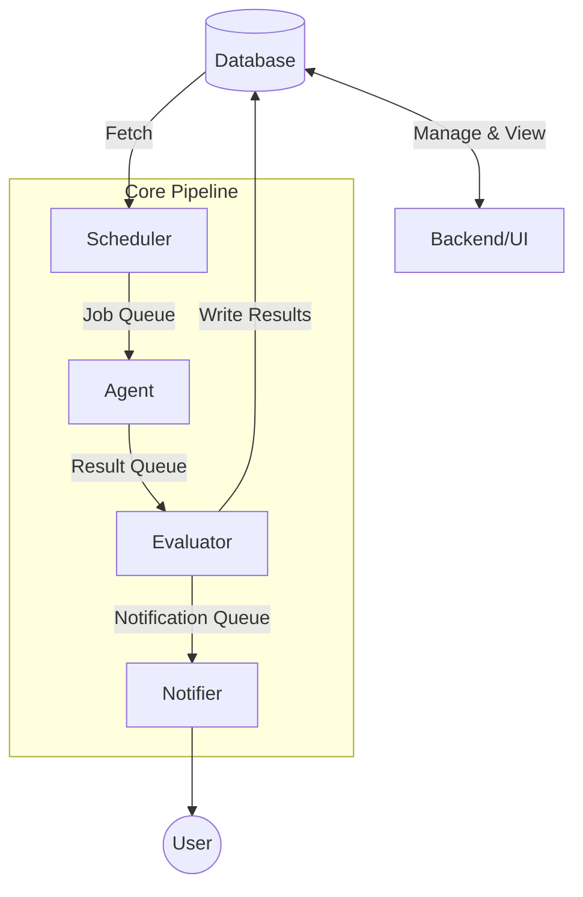

# guggr

guggr (Swabian for "looker") is a high-availability solution that keeps a constant eye on your workloads so you don't have to.

## Differences to Common Monitoring Solutions

- **Highly available** 🏗️: Uses RabbitMQ Quorum Queues and splits workloads to ensure that downtimes only impact small, isolated worker chunks.
- **Infrastructure-independent** ☁️: Deploy agents across diverse environments and infrastructures to monitor your services from anywhere.
- **Extensible** 🧩: Tailor the platform to your needs by writing and integrating custom plugins directly into your agents.
- **Configurable** ⚙️: Define granular, custom rules to manage how and when you receive notifications.
- **Independent** 🛠️: Built for flexibility—code specific microservices or single adapters to fit your unique instance requirements.

## Quick Start

TBD

## Architecture

_guggr_ is composed of several specialized components working in sync:

- **Web-Frontend and Backend** 🖥️ (Svelte/Golang): The central hub for users to visualize uptime data and manage monitor configurations.
- **Scheduler** 🗓️ (Rust): The orchestrator that fetches active monitors from the database and distributes them into the execution queue.
- **Agent** 🕵️ (Rust): Consumes jobs in the queue, performs the actual health checks, and reports job results back for evaluation.
- **Evaluator** 🧠 (Rust): The logic engine that processes job results against your custom rules to determine if a notification is necessary.
- **Notifier** 📢 (Golang): Delivers alerts to users via their preferred channels.

